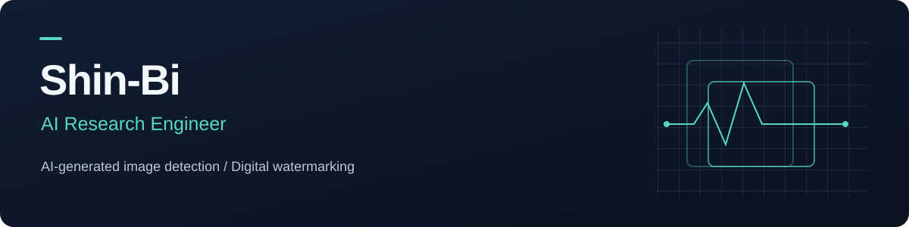

I research and build systems for **AI-generated image detection**, **digital watermarking**, and **image protection aimed at disrupting unauthorized LoRA training**. My work spans model experiments, robustness evaluation, algorithm optimization, and Python packages for backend integration.

**Python · PyTorch · NumPy · OpenCV · scikit-learn · Git**

### Professional work

| Project | My contribution | Read more |
| :--- | :--- | :--- |
| **Invisible Watermark** | Watermark insertion and detection, visual quality and robustness evaluation, performance optimization, and Python packaging. | [Project overview →](projects/invisible-watermark.md) |
| **AI Image Detection** | Detection model experiments, training and evaluation data preparation, and robustness testing under compression and resizing. | [Project overview →](projects/ai-detection.md) |
| **Anti-AI Filter** | Image-protection filters aimed at disrupting unauthorized LoRA training, visual-quality evaluation, and controlled fine-tuning experiments. | [Project overview →](projects/anti-ai-filter.md) |

### Patent

**[Adaptive watermarking system and method](https://doi.org/10.8080/1020250156868)**  
Co-inventor · Korean Patent No. **10-2998678** · Granted July 28, 2026  
Patent holder: 주식회사 모리 (MORI)

Led the technical development underlying the patent, including algorithm design, implementation, and experimental validation.

### Shipped apps

<table>
  <tr>
    <td width="104" align="center" valign="middle">
      
    </td>
    <td valign="top">
      
<strong>MORI</strong> A social and portfolio app for creators.

      
Contributed to product planning, UI/UX design, and app development.

      
<a href="https://play.google.com/store/apps/details?id=com.projectMori.app">Google Play</a> · <a href="https://apps.apple.com/kr/app/mori-%EC%B0%BD%EC%9D%98%EB%A0%A5%EC%9D%84-%EB%B3%B4%ED%98%B8%ED%95%98%EB%8A%94-%EC%B0%BD%EC%9E%91%EC%9E%90%EC%9D%98-%EB%94%94%EC%A7%80%ED%84%B8-%ED%8C%8C%ED%8A%B8%EB%84%88/id6474066988">App Store</a>

    </td>
  </tr>
  <tr>
    <td width="104" align="center" valign="middle">
      
    </td>
    <td valign="top">
      
<strong>부스모리 · Booth MORI</strong> A booth sales management app for creators at offline events.

      
Contributed to product planning, UI/UX design, and app development.

      
<a href="https://play.google.com/store/apps/details?id=com.mori.lite.app">Google Play</a> · <a href="https://apps.apple.com/us/app/%EB%B6%80%EC%8A%A4%EB%AA%A8%EB%A6%AC-%EB%B6%80%EC%8A%A4-%EA%B3%84%EC%82%B0%EA%B8%B0/id6743000144">App Store</a>

    </td>
  </tr>
</table>

### Public implementation

**[CV Robustness Benchmark →](https://github.com/Shin-Bi/cv-robustness-benchmark)**  
A runnable Python example of image robustness evaluation: JPEG, resize, and crop conditions, a fixed validation-selected threshold, and per-image predictions with CSV reports and plots. Uses public handwritten digits and runs on CPU.

[Browse the code](https://github.com/Shin-Bi/cv-robustness-benchmark/tree/main/src/cv_robustness) · [See the results](https://github.com/Shin-Bi/cv-robustness-benchmark/blob/main/examples/baseline/report.md) · [Read the protocol](https://github.com/Shin-Bi/cv-robustness-benchmark/blob/main/docs/evaluation.md)

An independent portfolio example, separate from the professional projects above.

### How I work

- **Define the test before interpreting the result.** Keep training, model selection, and evaluation separate; document the conditions behind each result.
- **Investigate failure cases.** Use image transformations and negative examples to understand where a method stops working.
- **Make research usable.** Turn implementations into tested packages with clear interfaces and integration documentation.

The professional project pages describe my responsibilities and development process at a high level. Company source code, internal datasets, and nonpublic benchmark results are not included.

<strong>한국어 소개</strong>

AI 생성 이미지 탐지, 디지털 워터마킹, 무단 LoRA 학습 방해를 목표로 하는 이미지 보호 필터를 연구·개발하는 엔지니어입니다. 모델 실험과 성능 평가부터 알고리즘 최적화, 백엔드 연동용 Python 패키지 개발까지 수행하고 있습니다.

- **Invisible Watermark:** 삽입·검출 알고리즘 구현, 비가시성·변형 강건성 평가, 처리 성능 개선 및 패키징
- **AI Image Detection:** 탐지 모델 실험, 학습·평가 데이터 구성, 압축·리사이즈 조건에서의 성능 검증
- **[Anti-AI Filter](projects/anti-ai-filter.md):** 무단 LoRA 학습 방해를 위한 이미지 보호용 섭동 연구, 화질과 보호 효과의 균형 평가, LoRA 미세조정 비교 실험

**[적응형 워터마킹 시스템 및 방법](https://doi.org/10.8080/1020250156868)**의 공동발명자로 등재되어 있으며, 특허의 기반이 된 알고리즘 설계·구현·실험 검증 등 기술 개발을 주도했습니다. 대한민국 등록특허 제10-2998678호로, 2026년 7월 28일 등록되었으며 특허권자는 주식회사 모리입니다.

출시된 앱 **MORI**와 **부스모리**의 서비스 기획·UI/UX 디자인·앱 개발에 참여했습니다. MORI는 창작자를 위한 소셜·포트폴리오 앱이며, 부스모리는 오프라인 행사에서 창작자의 부스 판매 관리를 돕는 앱입니다.

공개 코드 예제인 **[CV Robustness Benchmark](https://github.com/Shin-Bi/cv-robustness-benchmark)**에서는 공개 데이터로 평가 과정을 재현할 수 있습니다. 회사 프로젝트와 별도로 만든 개인 포트폴리오 예제입니다.

클라우드 관련 업무는 AWS KMS 연동 코드와 연동 문서 작성이며, 클라우드 리소스 설정과 실제 배포·운영은 다른 담당자가 수행했습니다.

